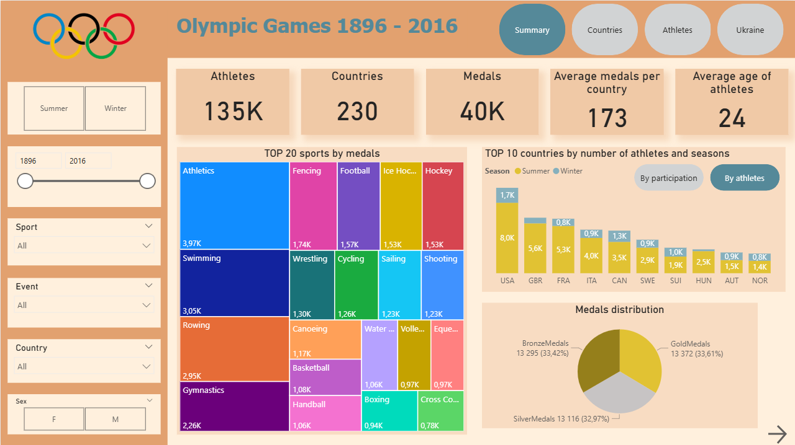
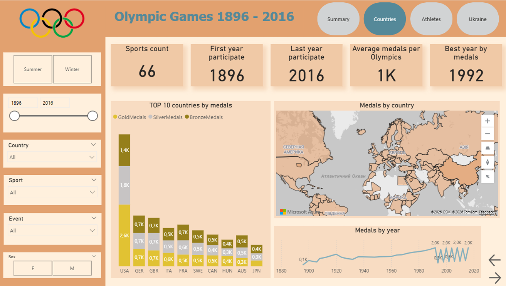
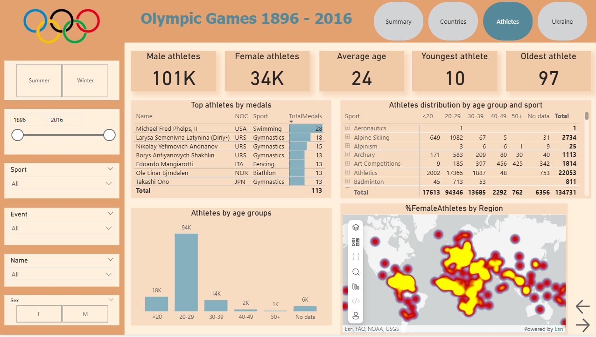
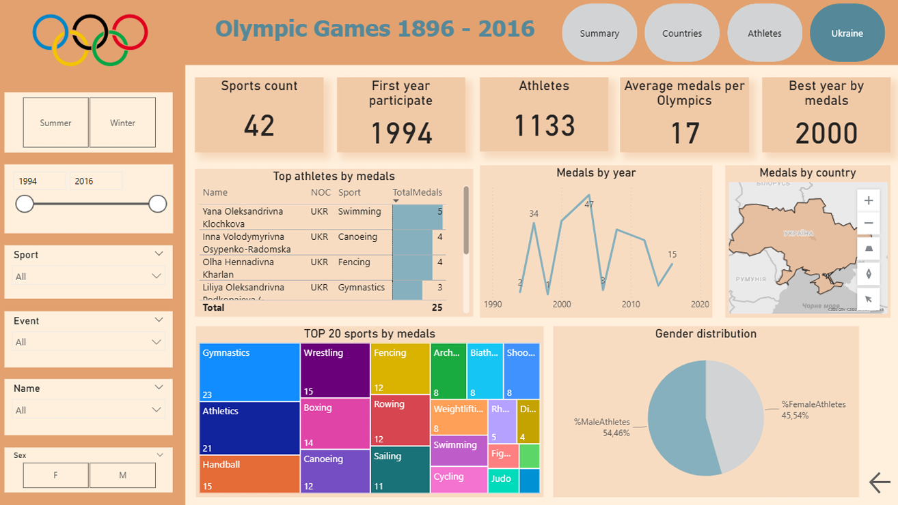

# 🏅 Olympic Games Analytics Dashboard (Power BI)

## 📊 Project Overview
This project presents an interactive **Power BI dashboard** analyzing historical data from the Olympic Games (1896–2016).
The dashboard provides insights into athlete participation, medal distribution, country performance, and trends across different Olympic years.

---

## 🎯 Objectives
- Analyze medal distribution by country and sport
- Explore historical trends in Olympic Games
- Compare performance across countries and years
- Identify key patterns in athlete demographics

---

## 📁 Dataset
The dataset includes:
- Athlete information (gender, age)
- Countries and participation
- Olympic years (1896–2016)
- Medal types (Gold, Silver, Bronze)
- Sports and events

*[(Dataset)](https://www.kaggle.com/datasets/heesoo37/120-years-of-olympic-history-athletes-and-results)*

---

## 🛠 Data Preparation
- Data cleaning and preprocessing performed in Power BI
- Handling missing values and inconsistencies
- Data transformation for analysis

---

## 🧮 DAX Measures
Custom DAX measures were created to enhance analysis, including:
- Total medals
- Average medals per country
- Athlete count
- Gender distribution
- Year-based aggregations

---

## 📈 Dashboard Features
- KPI cards (athletes, countries, medals, averages)
- Medal distribution by country and sport
- Trends over time (line charts)
- Geographic visualization (map)
- Athlete demographics (age, gender)
- Interactive filters:
  - Year
  - Country
  - Sport
  - Event

---

## 📸 Dashboard Preview

---

## 🚀 How to Use
1. Download the `.pbix` file from this repository  
2. Open it using Power BI Desktop  
3. Interact with filters and visuals  

---

## 💡 Key Insights
- Significant growth in athlete participation over time  
- Certain countries dominate specific sports  
- Medal distribution is highly uneven across countries  
- Gender participation has increased significantly in recent years  

---

## 🛠 Tools & Technologies
- Power BI  
- DAX (Data Analysis Expressions)  
- Data cleaning & transformation  

---

## 📌 Author
Natalia Patsai  
